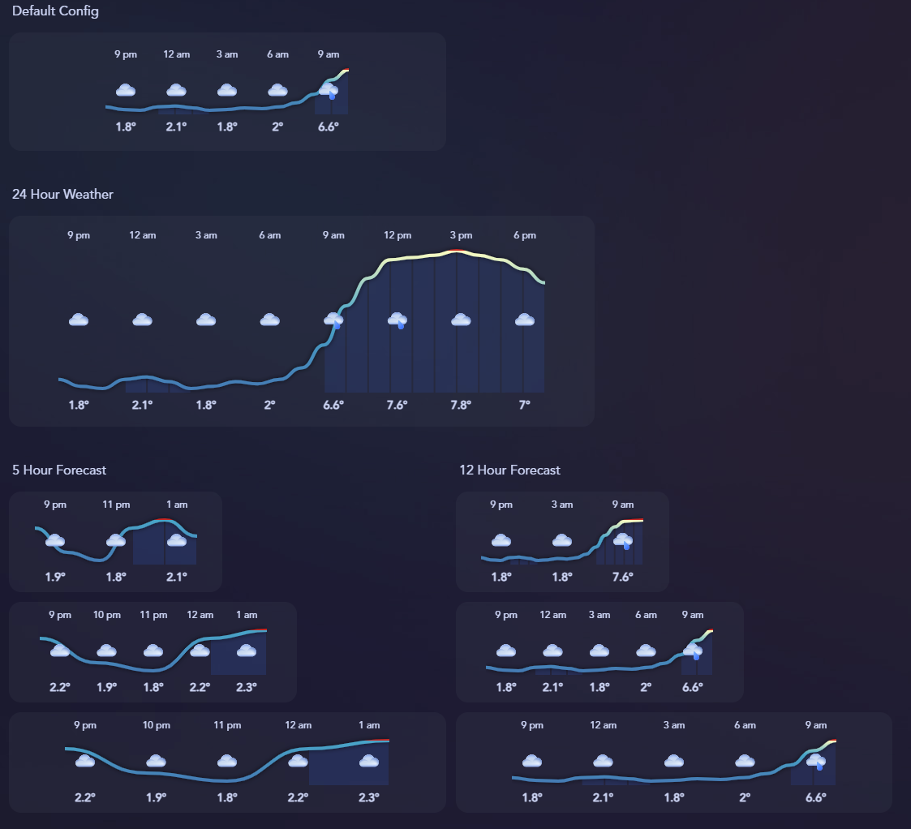
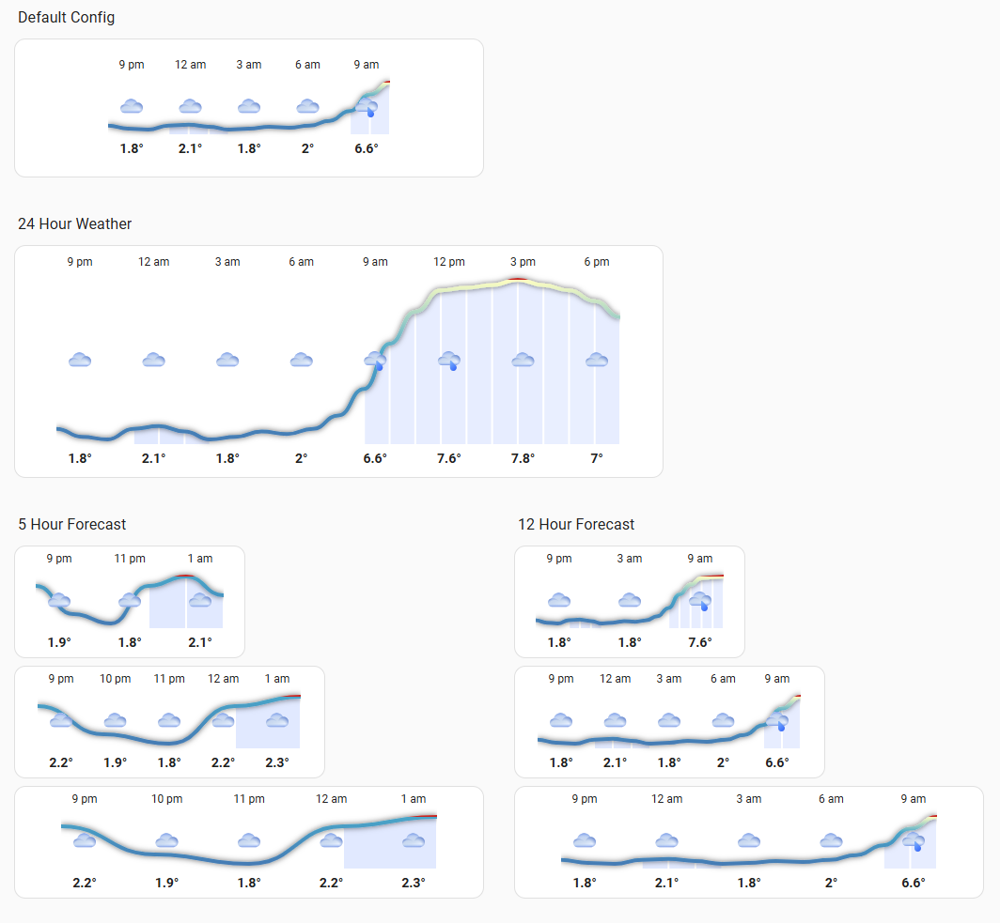
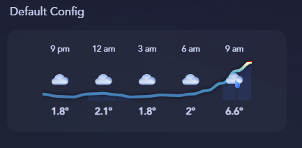
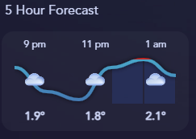
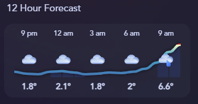
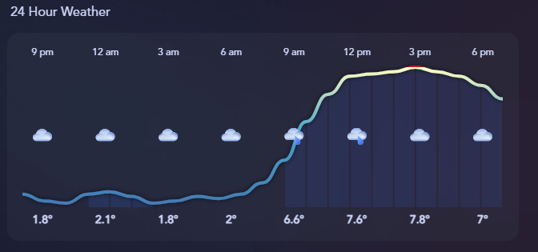

# hourly-weather
This is a custom button card template that generates an SVG by looping through the forecast attribute populated by the `weather.get_forecasts` service. It shows the hour, temperature, condition icon, line chart of the temperature and precipitation probability.

## Preview



## Contents
- `template-sensor.yaml` - Template trigger sensor to load forecast data every hour
- `hourly-forecast.yaml` - Button card template
- `icons.zip` - SVG icons for the weather conditions

## Card Variables

| Name | Type | Default | Description |
| --- | --- | --- | --- |
| `weather_forecast` | *string* | **Required** | sensor that contains the `forecast` attribute containing a json object |
| `width` | *int*| optional | the intrinsic width in px of the generated svg, default: 300 |
| `height` | *int* | optional | the intrinsic height in px of the generated svg, default: 110 |
| `hour_slices` | *int* | optional | number of hour 'slices' to show, default: 5 |
| `hour_group` | *int* | optional | how many hours are grouped into each slice, default: 3 |
| `icon_base` | *string* | optional | relative url to icons, default: /local/weather/ |

# Installation
1. Install button-card - highly recommend to-do so via HACS. [custom:button-card](https://github.com/custom-cards/button-card)
2. Add the `template-sensor.yaml` config to your `configuration.yaml`. This is for retrieving the hourly forecast. Your will need to edit and change the target `entity_id: weather.home` to your weather entity.  Restart HA or reload the template entities via Developer tools. 
3.  To add a button card template to your dashboard you need to add them to the raw yaml of your dashboard. Edit your dashboard, click the 3 menu dots in the top right, then 'Raw Configuration editor'. This will edit the dashboard yaml. Paste the contents of `hourly-forecast.yaml` at the top. **Careful, editing this can corrupt your dashboard**. 
4. For the icons extract `icons.zip` to `www\weather` to your home assistant config folder. 
5. Create a new card and use the code from one of the examples below.
6. Admire your new hourly weather chart!

## Examples
**Default Configuration**



```
type: custom:button-card
template: hourly-forecast
variables:
  weather_forecast: sensor.weather_forecast_hourly
```

**5 Hour Forecast** *Small*



```
type: custom:button-card
template: hourly-forecast
variables:
  weather_forecast: sensor.weather_forecast_hourly
  width: 200
  height: 110
  hour_slices: 3
  hour_group: 2
grid_options:
  columns: 6
  rows: 2  
card_mod:
  style: |
    :host {height: 100% !important;}
```

**12 Hour Forecast** *Medium*



```
type: custom:button-card
template: hourly-forecast
variables:
  weather_forecast: sensor.weather_forecast_hourly
  width: 280
  height: 110
  hour_slices: 5
  hour_group: 3
grid_options:
  columns: 8
  rows: 2  
card_mod:
  style: |
    :host {height: 100% !important;}
```

**24 Hour Forecast** *Large*



```
type: custom:button-card
template: hourly-forecast
variables:
  weather_forecast: sensor.weather_forecast_hourly
  width: 600
  height: 230
  hour_slices: 9
  hour_group: 3
grid_options:
  columns: 16
  rows: 4
card_mod:
  style: |
    :host {height: 100% !important;}
```

## Notes
#### Home Assistant Sections Support
If you're using sections there is a bug in button-card which means it doesn't play nicely. To support sections and grid_options install card_mod and use the code below: 

```
type: custom:button-card
template: hourly-forecast
variables:
  weather_forecast: sensor.weather_forecast_hourly
grid_options:
  columns: 16
  rows: 4
card_mod:
  style: |
    :host {height: 100% !important;}
```

#### Hour Slices & Groups
You can mix-and match the size of the card and the grouping. `hour_slice` is the number of groups to show and `hour_group` is how many hours in each slice. The car will determin the min/max temperature and will attempt to show the highest or lowest temperature for the given slice.

#### Home Assistant Weather Popup
If you want the built in weather popup to show when clicking the card add your weather provider as the entity when you configure your card
```
type: custom:button-card
template: hourly-forecast
entity: weather.seytroux
variables:
  weather_forecast: sensor.weather_forecast_hourly
```

#### Forecast Conditions
Forecast conditions are matched based on the text. Not all weather providers have the same list, you can edit the list the `weathericon_map` function to match an icon against a specific forecast. 

#### Weather providers JSON
Again, not all weather providers are equal. Some don't provide all entities in their forecast. These are the keys required to be returned for full functionality.

| Key | Type | Description |
| --- | --- | --- | 
| temperature | *decimal* |
| condition | *string* | Short weather description |
| precipitation_probability | *decimal* | 0-100% |

Example of the tomorrow.io forecast JSON  
```
[
  {
    "datetime": "2025-04-23T18:00:00+00:00",
    "condition": "rainy",
    "precipitation_probability": 60,
    "wind_bearing": 200,
    "temperature": 5.9,
    "dew_point": 5.7,
    "wind_speed": 9.72,
    "precipitation": 1.09,
    "humidity": 98
  }
]
```

## Required
- Home Assistant - [home-assistant.io](https://www.home-assistant.io/) 
- button-card lovelace - [custom:button-card](https://github.com/custom-cards/button-card)
- card_mod - to fix the issue with sections layout
