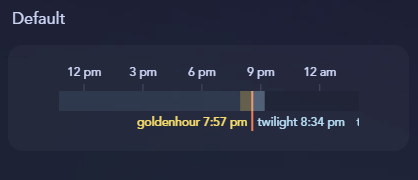
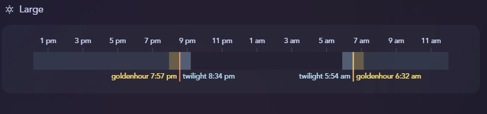
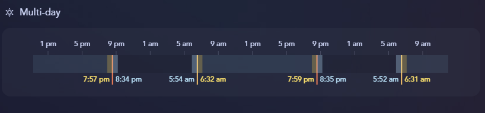
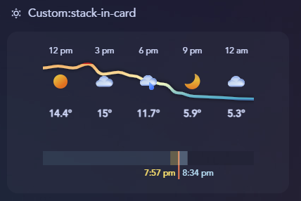

# hourly-solar
This is a custom button card template that generates an SVG of the solar events for a given time period. It automatically calculates **golden hour** (morning/evening). **civil twilight**, sunrise & sunset based on your location lat/lon. It displays the hour, solar event and a bar depicting the phase (twilight, sunrise, golden hour, day, night).

My motivation for this was as a photographer I wanted to know the best times for light as the seasons change.

## Card Preview


## Contents
- [`hourly-solar.yaml`](./hourly-solar.yaml) - Button card template

## Card Variables

| Name | Type | Required | Description |
| --- | --- | --- | --- |
| `location` | *string* | **Required** | a zone or person that contains a lat/lon attribute |
| `width` | *int*| optional | the intrinsic width in px of the generated svg, default: 300 |
| `height` | *int* | optional | the intrinsic height in px of the generated svg, default: 70 |
| `hour_slices` | *int* | optional | number of hour 'slices' to show, default: 5 |
| `hour_group` | *int* | optional | how many hours are grouped into each slice, default: 3 |
| `show_solar_hours` | *boolean* | optional | relative |
| `show_solar_names` | *boolean* | optional | relative |
| `show_hour_labels` | *boolean* | optional | relative |
| `show_daynight_bars` | *boolean* | optional | relative |
| `colors` | *array* | optional | See [Colors](#colors) |

## Colors
The bar color can be set for each solar event and, if you decide to show the daynight bars those too. 

| Name | Color |
| --- | --- | 
| `day` | `'#87CEEB'` |
| `night` | `'#87CEEB'` |
| `goldenhour` | `'#FFE066'` |
| `twilight` | `'#AEDFF7'` |
| `sunrise` | `'#FFC266'` |
| `sunset` | `'#FF7B54'` |


# Installation
1. Install button-card - highly recommend to-do so via HACS. [`custom:button-card`](https://github.com/custom-cards/button-card)
2. To add a button card template to your dashboard you need to add them to the raw yaml of your dashboard. Edit your dashboard, click the 3 menu dots in the top right, then 'Raw Configuration editor'. This will edit the dashboard yaml. Paste the contents of [`hourly-solar.yaml`](./hourly-solar.yaml) at the top. **Careful, editing the raw yaml can corrupt your dashboard**. 
3. Create a new card and use the code from one of the [examples](#examples) below.
4. Admire your new hourly weather chart!

## Examples
**Default Configuration**


```
type: custom:button-card
template: hourly-solar
variables:
  location: zone.home
```
**Default All Configuration Variables**

```
type: custom:button-card
template: hourly-solar
variables:
  location: zone.home
  width: 300
  height: 70
  hour_slices: 5
  hour_group: 3
  show_solar_hours: true
  show_solar_names: true
  show_hour_labels: true
  show_daynight_bars: true
  colors:
    day: '#87CEEB'
    night: '#000000'
    goldenhour: '#FFE066'
    twilight: '#AEDFF7'
    sunrise: '#FFC266'
    sunset: '#FF7B54'
```

**Large Wide**



```
grid_options:
  columns: 24
type: custom:button-card
template: hourly-solar
variables:
  location: zone.home
  width: 700
  height: 80
  hour_slices: 12
  hour_group: 2
```

**Multi-day Wide**



```
grid_options:
  columns: 24
type: custom:button-card
template: hourly-solar
variables:
  location: zone.home
  width: 700
  height: 80
  hour_slices: 12
  hour_group: 4
  show_solar_names: false
```

**Combination with `hourly-forecast` using `custom:stack-in-card`**

You can use the [`custom:stack-in-card`](https://github.com/custom-cards/stack-in-card) to make a single card that displays both my [`hourly-forecast`](../hourly-forecast) and [`hourly-solar`](./) card. Both cards have the same default slices and grouping so the hour labels match.



```
type: custom:stack-in-card
mode: vertical
cards:
  - type: custom:button-card
    template: hourly-weather
    variables:
      weather_forecast: sensor.tomorrow_io_forecast_hourly
    styles:
      card:
        - border: 0
  - type: custom:button-card
    template: hourly-solar
    variables:
      location: zone.home
      height: 40
      show_solar_names: false
      show_hour_labels: false
    styles:
      card:
        - border: 0
```

## Notes
#### Home Assistant Sections Support
If you're using sections there is a bug in button-card which means it doesn't play nicely. To support sections and grid_options install [`card_mod`](https://github.com/thomasloven/lovelace-card-mod) and you can use the code below. You can then specify the `grid_options` `rows`/`columns` 

```
type: custom:button-card
template: hourly-solar
variables:
  location: zone.home
grid_options:
  columns: 16
  rows: 4
card_mod:
  style: |
    :host {height: 100% !important;}
```

#### Hour Slices & Groups
You can mix-and match the size of the card and the grouping. `hour_slice` is the number of groups to show and `hour_group` is how many hours in each slice. I suppose I should picked more descriptive variable names! Next time I will.


## Required
- Home Assistant - [home-assistant.io](https://www.home-assistant.io/) 
- button-card lovelace - [`custom:button-card`](https://github.com/custom-cards/button-card)
- card_mod - to fix the issue with sections layout [`card_mod`](https://github.com/thomasloven/lovelace-card-mod)
