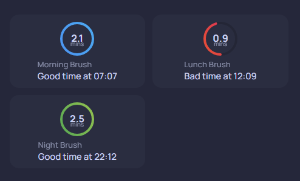

# oralb-toothbrush
This button card template displays a list of radial graphs reporting the number of times and duration you've cleaned your teeth today. A lot of moving parts and requires setting up a template sensor to normalise the data from the toothbrush integration. 

## Card Preview


## Contents
- [`oralb-toothbrush.yaml`](./oralb-toothbrush.yaml)  
  Contains three separate button card templates:

  1. `oralb-toothbrush` - The main template referenced on your dashboard. Shows an overview of the toothbrush, such as last brushing, battery, or current session.
  2. `card_toothbrush_brushing` - Used within a loop to display individual brushing events. Shows duration and date/time 
  3. `graph_radial_raw` - Custom radial graph which is referenced from the brushing event card to visualize duration

- [`template-sensor.yaml`](./template-sensor.yaml)  
  The template sensor configuration used to generate the data displayed by the toothbrush cards.or.yaml`](./template-sensor.yaml) - The template sensor configuration

## Card Variables

| Name | Type | Required | Description |
| --- | --- | --- | --- |
| `toothbrush_today` | *string* | **Required** | Entity id of the template sensor that contains the attributes calculated from the Oral-B toothbrush |


# Installation
1. Setup Oral-B Integration - [`Oral-B`](https://www.home-assistant.io/integrations/oralb/)
2. Add the `template-sensor.yaml` config to your `configuration.yaml`. This is for calculting your brushing time from the Oral-B toothbrush. YOu will need to edit and change the 3x trigger entity_id's `entity_id: sensor.dave_toothbrush_duration`, `entity_id: sensor.dave_toothbrush_sector`, `entity_id: sensor.dave_toothbrush_duration` as well as changing the name and unique id of the sensor `name: "Dave Toothbrush Today"` and `unique_id: "dave_toothbrush_today"`  to your desired sensor name. Restart HA or reload the template entities via Developer tools. 
3. Install button-card - highly recommend to-do so via HACS. [`custom:button-card`](https://github.com/custom-cards/button-card)
4. Install layout-card - Via HACS as well [`custom:layout-card`](https://github.com/thomasloven/lovelace-card-mod)
5. Add button card template to your dashboard via raw yaml of your dashboard. Edit your dashboard, click the menu, 3 dots in the top right, then 'Raw Configuration editor'. This will edit the dashboard yaml. Paste the contents of [`oralb-toothbrush.yaml`](./oralb-toothbrush.yaml) at the top. **Careful, editing the raw yaml can corrupt your dashboard**.
6. BRUSH YOUR TEETH! - after setting up the template sensor check the attribute is being populated. it's a json array and look something like:
```
brush_data:
  - name: Morning
    duration: 129
    timestamp: "2026-01-06T07:07:46.035649+01:00"
    sectors:
      - sector 1
      - sector 2
      - sector 3
      - sector 4
brush_count: 1
last_sectors_cleaned: []
icon: mdi:toothbrush-paste
friendly_name: Dave Toothbrush Today
```
7. Create a new card and use the code from one of the [examples](#examples) below.
8. Admire your new Oral-b toothbrush report!

## Examples
**Default Configuration**


```
type: custom:button-card
template: oralb-toothbrush
type: custom:button-card
variables:
  toothbrush_today: sensor.dave_toothbrush_today
```

## Notes
#### A lot of moving parts
This button card template is slightly different to my others in that it has a lot of moving parts and makes use of advance dynamic cards via javascript to split an attribute into a json array. I've not seen documented much but it's such a useful feature. 

There's actually 3 button card templates used here. the main template: `oralb-toothbrush`, the looped `card_toothbrush_brushing` and the custom `graph_radial_raw`. All 3 templates are required for this template to work. 

## Required
- Home Assistant - [home-assistant.io](https://www.home-assistant.io/)
- OralB Integration - of course an oralb toothbrush with its associated HA integration - [`Oral-B`](https://www.home-assistant.io/integrations/oralb/)
- custom:button-card - [`custom:button-card`](https://github.com/custom-cards/button-card)
- custom:layout-card - to fix the issue with sections layout [`custom:layout-card`](https://github.com/thomasloven/lovelace-card-mod)
